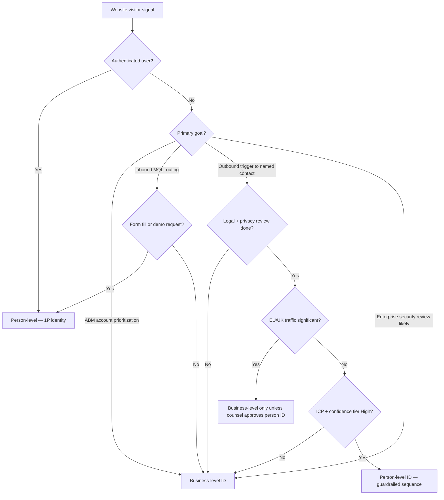

# Person vs Business Identification — Decision Matrix

*Choose identification level before buying or deploying a vendor.*

---

## Decision tree

---

## Comparison matrix

| Dimension | Business (company) ID | Person (contact) ID |
|---|---|---|
| **Data source** | Reverse-IP, firmographic graph | Identity network, LinkedIn match, cookies |
| **Typical accuracy** | 60–85% company match (vendor-dependent) | 40–70% person match; higher with form/login |
| **False positive risk** | Shared office, VPN, agency | Wrong person, stale job, household device |
| **Privacy risk** | Lower — B2B firm data | Higher — individual tracking |
| **GDPR sensitivity** | Moderate — still needs disclosure | High — consent/LIA review typical |
| **CCPA sensitivity** | Moderate | High — opt-out obligations |
| **Best GTM use** | ABM lists, account scoring, SDR research queue | Trigger outbound, executive alerts |
| **CRM object** | Account + intent score | Contact + activity + lawful basis note |
| **Slack alert** | `#intent-company` | `#intent-person` (restricted) |
| **Sequence fit** | Account-based nurture | `cold-email-strategy` trigger branch |
| **Cost profile** | $$ platform or per-domain | $$$ per identified person |

---

## Stage-based recommendation

| Company stage | Start with | Add person ID when |
|---|---|---|
| **<$1M ARR** | Clearbit Reveal / Leadfeeder free tier — company only | Never auto; manual LinkedIn research |
| **$1–5M ARR** | Company ID + ICP routing to SDR | Pilot RB2B/Warmly with legal OK, US-only traffic |
| **$5M+ ARR** | 6sense/Demandbase account intent + ABM | Person ID for Tier 1 accounts with RevOps + legal SOP |
| **Enterprise / EU-heavy** | Company ID + first-party form strategy | Person ID only post-counsel; prefer 1P identity |

---

## Confidence tier actions

| Tier | Business ID action | Person ID action |
|---|---|---|
| **High** | Create CRM account; assign owner if ICP | Allow 1–2 touch trigger sequence |
| **Medium** | Add to ABM audience; no sales ping | Slack alert → manual research |
| **Low** | Log only | Discard for outreach; do not store PII |

---

## Vendor level mapping (summary)

| Vendor | Primary level | Notes |
|---|---|---|
| Clearbit / HubSpot Breeze Intelligence | Company (+ person on form) | Reveal = company; enrichment on known email |
| RB2B | Person | LinkedIn-profile visitor ID |
| 6sense | Company (account) | Person via integrations, not core IP reveal |
| Demandbase | Company | ABM account identification |
| ZoomInfo WebSights | Company | Feeds ZoomInfo account records |
| Leadfeeder / Dealfront | Company | SMB-friendly website company ID |
| Warmly | Person + company | Chat + person deanonymization |
| Koala | Person + company | Product-led teams; Slack alerts |
| Factors.ai | Company + journey | Product analytics + firm ID |
| Albacross | Company | EU-origin vendor; company focus |

Full comparison: `visitor-id-vendor-comparison.md`

---

## Go / no-go for person-level ID

**Go** (all required):
- [ ] Privacy checklist complete (`visitor-id-privacy-gtm.md`)
- [ ] US-primary traffic OR EU counsel sign-off
- [ ] ICP filter automated before CRM create
- [ ] Opt-out honored across email + LinkedIn
- [ ] Sequence capped (≤2 auto touches on visitor-only signal)
- [ ] Security questionnaire template updated if vendor subprocesses data

**No-go:**
- EU-heavy site without consent strategy
- No DPA with vendor
- SDR team will "spray" all alerts
- No enrichment verification step
- Healthcare/finance regulated vertical without legal review

---

## Cross-links

- Master playbook: `visitor-identification-playbook.md`
- Privacy: `visitor-id-privacy-gtm.md`
- Vendors: `visitor-id-vendor-comparison.md`
- Skills: `website-visitor-identification`, `icp-scoring`, `inbound-triage`, `cold-email-strategy`
